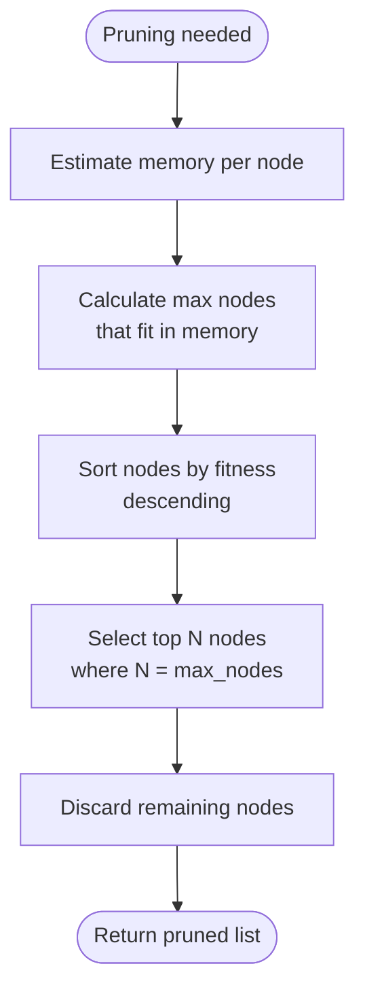

# Algorithm Flow Diagram

This document contains Mermaid diagrams showing the algorithm flow for the pruned BFS search.

## Main Algorithm Flow

```mermaid
flowchart TD
    Start([Start: pruned_bfs_search]) --> Init[Initialize:<br/>- current_level = [empty snake]<br/>- best_snake = None<br/>- max_length = 0]
    Init --> Loop{Current level<br/>not empty?}
    Loop -->|No| End([Return best_snake])
    Loop -->|Yes| Generate[For each node:<br/>- Get legal dimensions<br/>- Generate valid children<br/>- Track best snake]
    Generate --> Estimate[Estimate memory usage<br/>for next level]
    Estimate --> Check{Memory limit<br/>exceeded?}
    Check -->|Yes| Prune[Prune by fitness:<br/>- Sort by fitness<br/>- Keep top nodes]
    Check -->|No| Free[Free previous level]
    Prune --> Free
    Free --> Update[Update:<br/>- current_level = next_level<br/>- level_count++]
    Update --> Loop
```

## Node Extension Flow


## Pruning Flow



## Priming Strategy Flow


## Memory Management Flow


## Related Documentation

- [Pruned BFS Algorithm](../algorithm/pruned-bfs.md) - Detailed algorithm description
- [Algorithm Overview](../algorithm/overview.md) - Algorithm overview
- [Memory Management](../architecture/memory-management.md) - Memory optimization

