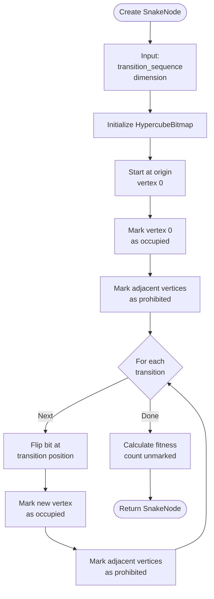
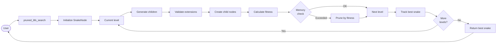
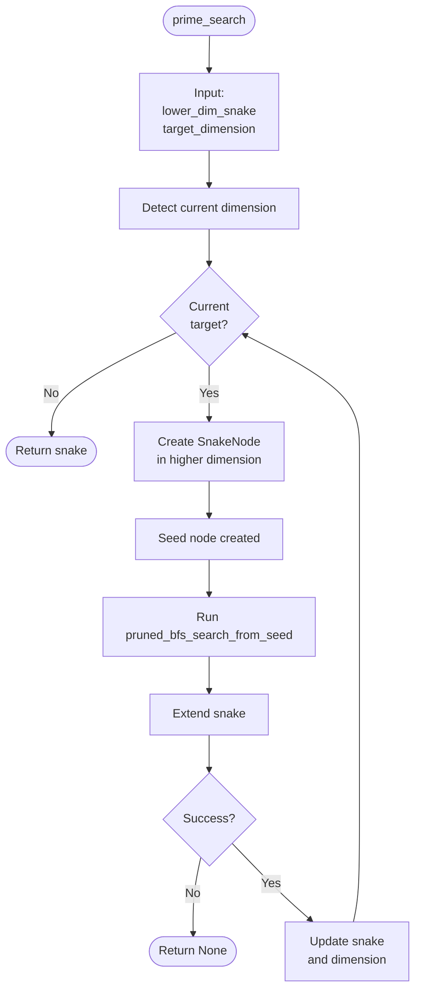
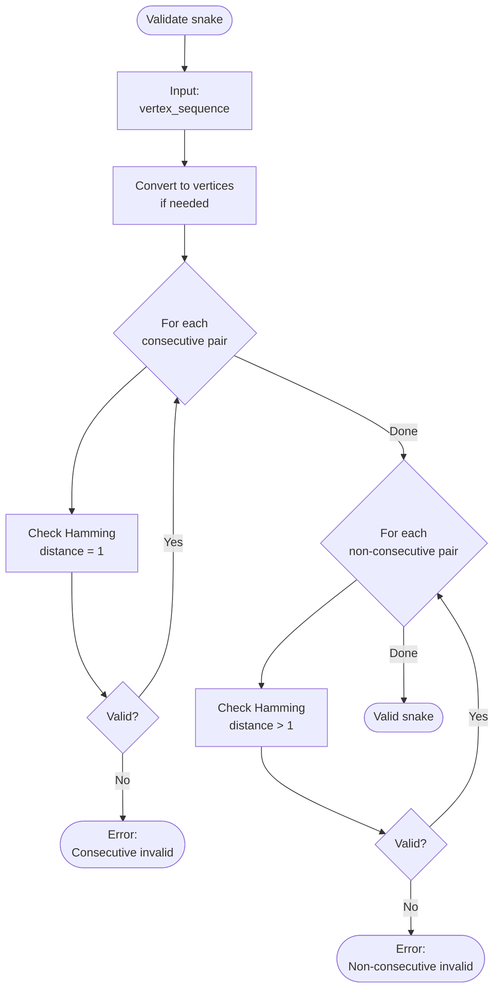
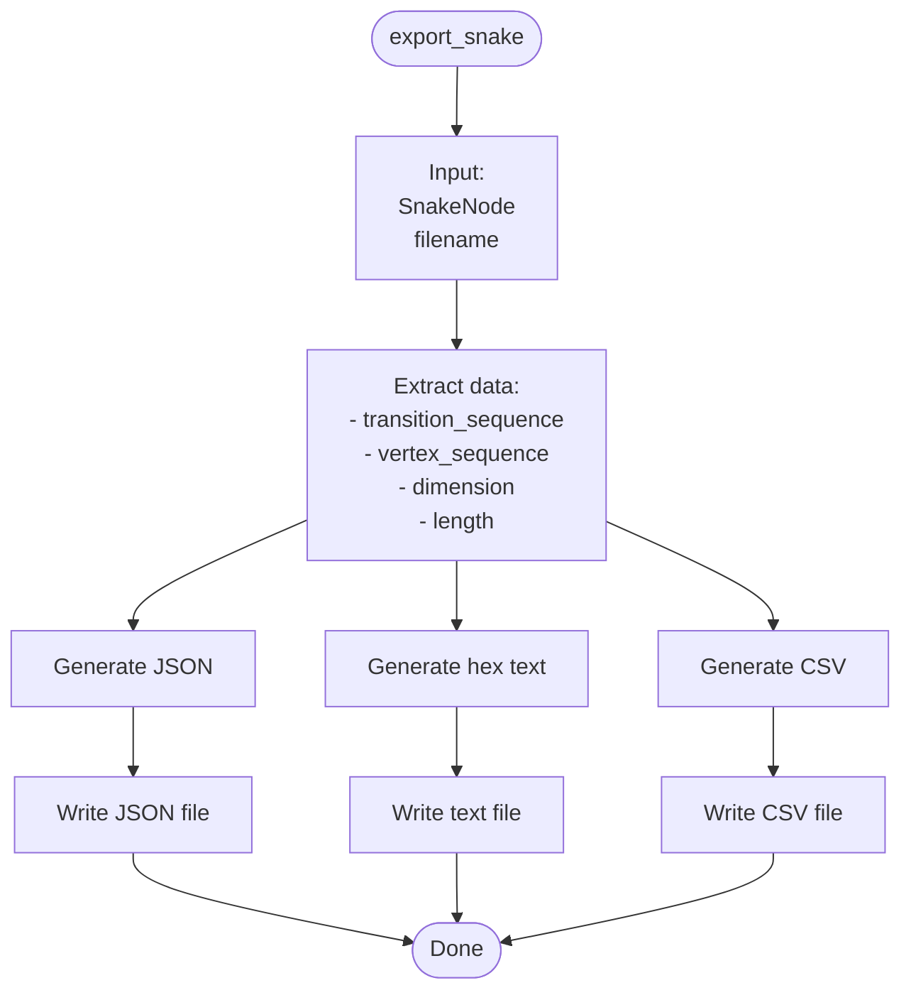

# Data Flow Diagrams

This document contains Mermaid diagrams showing data flow through the system.

## SnakeNode Creation Flow



## Bitmap Operations Flow

```mermaid
flowchart TD
    Start([Bitmap operation]) --> Op{Operation<br/>type?}
    Op -->|set_bit| Set[Set bit at vertex]
    Op -->|get_bit| Get[Get bit at vertex]
    Op -->|count_unmarked| Count[Count unmarked vertices]
    
    Set --> Calc1[Calculate word index<br/>vertex >> 6]
    Calc1 --> Calc2[Calculate bit index<br/>vertex & 63]
    Calc2 --> Update[Update bitmap[word_idx]<br/>|= 1 << bit_idx]
    Update --> End1([Done])
    
    Get --> Calc3[Calculate word index]
    Calc3 --> Calc4[Calculate bit index]
    Calc4 --> Check[Check bitmap[word_idx]<br/>& 1 << bit_idx]
    Check --> End2([Return bool])
    
    Count --> Iterate[Iterate all vertices]
    Iterate --> Check2{Vertex<br/>marked?}
    Check2 -->|No| Increment[Increment count]
    Check2 -->|Yes| Next[Next vertex]
    Increment --> Next
    Next --> More{More<br/>vertices?}
    More -->|Yes| Iterate
    More -->|No| End3([Return count])
```

## Search Data Flow



## Priming Data Flow



## Validation Flow



## Export Flow



## Related Documentation

- [Data Structures](../architecture/data-structures.md) - Core data structures
- [Algorithm Flow](../diagrams/algorithm-flow.md) - Algorithm flowcharts
- [Package Architecture](../diagrams/package-architecture.md) - Package structure

