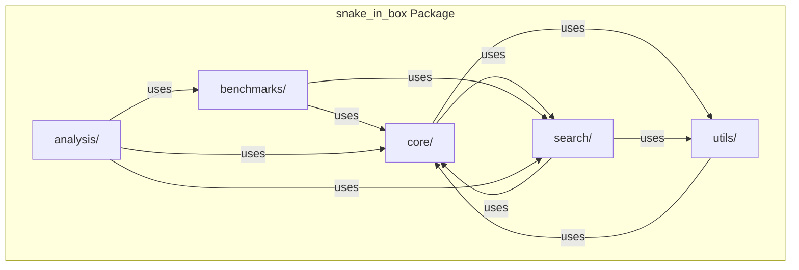
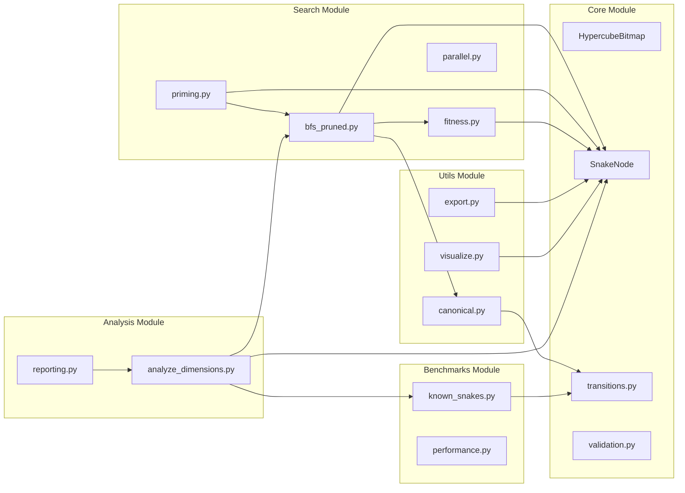
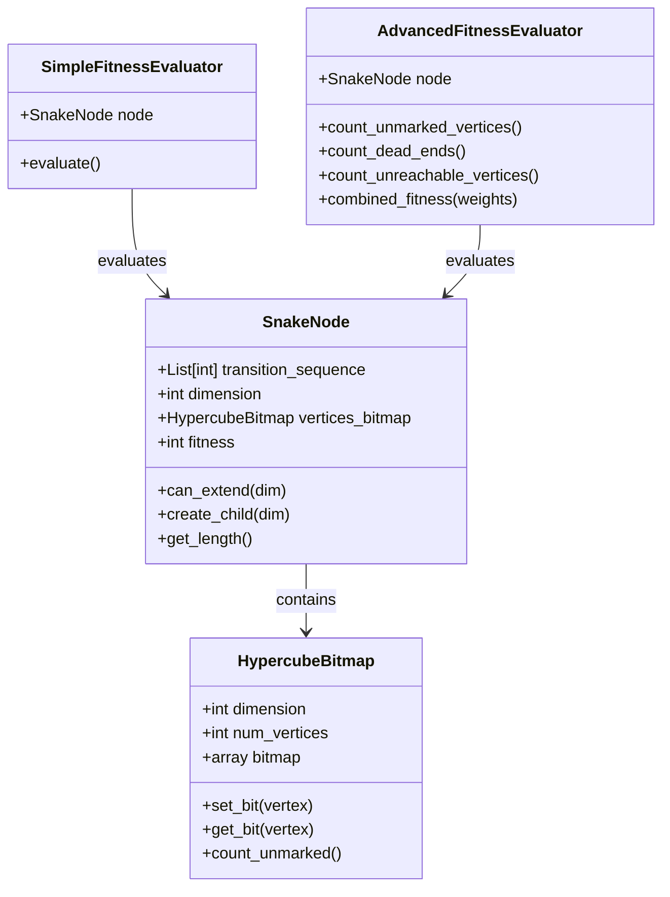

# Package Architecture Diagram

This document contains Mermaid diagrams showing the package structure and module dependencies.

## Package Structure



## Module Dependencies



## Data Flow

```mermaid
flowchart TD
    Start([User calls pruned_bfs_search]) --> Init[Initialize empty SnakeNode]
    Init --> Level[Current level = [empty snake]]
    Level --> Generate[Generate children for each node]
    Generate --> Check{Memory limit<br/>exceeded?}
    Check -->|Yes| Prune[Prune by fitness]
    Check -->|No| Next[Move to next level]
    Prune --> Next
    Next --> Best{Better snake<br/>found?}
    Best -->|Yes| Update[Update best snake]
    Best -->|No| Continue[Continue]
    Update --> Continue
    Continue --> More{More nodes<br/>to expand?}
    More -->|Yes| Level
    More -->|No| Return[Return best snake]
```

## Class Relationships



## Related Documentation

- [Package Structure](../architecture/package-structure.md) - Detailed package organization
- [Module Dependencies](../architecture/module-dependencies.md) - Module relationships
- [Data Structures](../architecture/data-structures.md) - Core data structures

