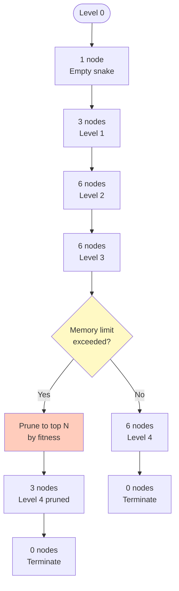
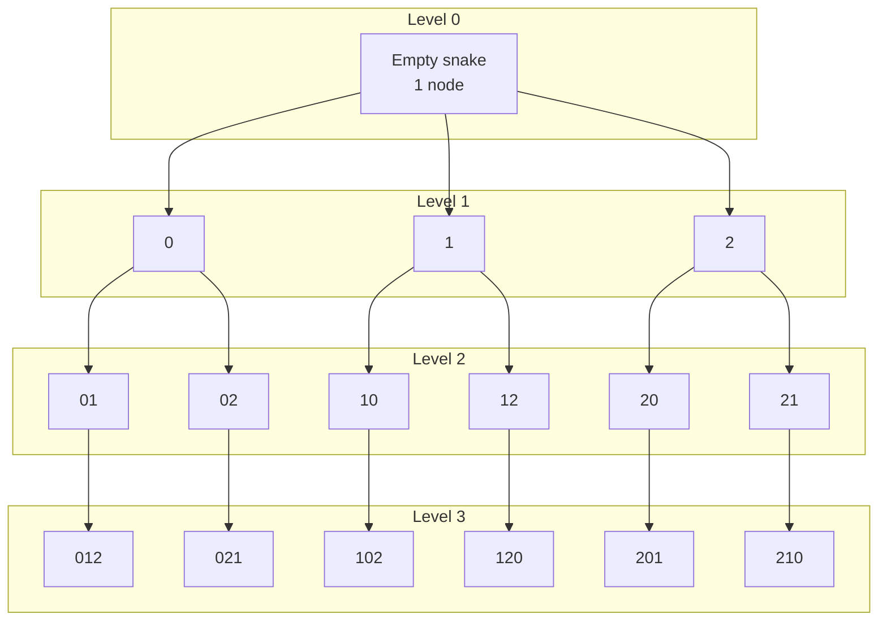

# Search Tree Visualization

This document contains Mermaid diagrams showing the search tree structure.

## Search Tree Structure (3D Example)

```mermaid
graph TD
    Root[{}<br/>Empty snake] --> L1_0[0]
    Root --> L1_1[1]
    Root --> L1_2[2]
    
    L1_0 --> L2_01[01]
    L1_0 --> L2_02[02]
    L1_1 --> L2_10[10]
    L1_1 --> L2_12[12]
    L1_2 --> L2_20[20]
    L1_2 --> L2_21[21]
    
    L2_01 --> L3_012[012]
    L2_02 --> L3_021[021]
    L2_10 --> L3_102[102]
    L2_12 --> L3_120[120]
    L2_20 --> L3_201[201]
    L2_21 --> L3_210[210]
    
    L3_012 --> L4_0120[0120<br/>Length 4]
    L3_021 --> L4_0210[0210<br/>Length 4]
    L3_102 --> L4_1021[1021<br/>Length 4]
    L3_120 --> L4_1201[1201<br/>Length 4]
    L3_201 --> L4_2012[2012<br/>Length 4]
    L3_210 --> L4_2102[2102<br/>Length 4]
    
    style Root fill:#e1f5ff
    style L4_0120 fill:#c8e6c9
    style L4_0210 fill:#c8e6c9
    style L4_1021 fill:#c8e6c9
    style L4_1201 fill:#c8e6c9
    style L4_2012 fill:#c8e6c9
    style L4_2102 fill:#c8e6c9
```

## Canonical Form Pruning

```mermaid
graph TD
    Root[{}<br/>Empty snake] --> L1[0<br/>Must start with 0]
    L1 --> L2_0[0,0]
    L1 --> L2_1[0,1<br/>Can introduce 1]
    L2_0 --> L3_00[0,0,0]
    L2_0 --> L3_01[0,0,1]
    L2_1 --> L3_10[0,1,0]
    L2_1 --> L3_11[0,1,1]
    L2_1 --> L3_12[0,1,2<br/>Can introduce 2]
    L3_12 --> L4[0,1,2,0<br/>Length 4]
    
    style Root fill:#e1f5ff
    style L4 fill:#c8e6c9
```

## Pruned BFS with Memory Limits



## Node State in Tree

```mermaid
graph LR
    Node[SnakeNode<br/>transition_sequence: [0,1,2]<br/>dimension: 3<br/>fitness: 2] --> Bitmap[HypercubeBitmap<br/>Marked vertices:<br/>0,1,2,3,4,5,6<br/>Unmarked: 1]
    Node --> Children[Children:<br/>[0,1,2,0]<br/>[0,1,2,1]<br/>[0,1,2,2]<br/>[0,1,2,3]]
    
    style Node fill:#e1f5ff
    style Bitmap fill:#fff9c4
    style Children fill:#c8e6c9
```

## Level-by-Level Expansion



## Related Documentation

- [Canonical Form](../algorithm/canonical-form.md) - Symmetry reduction
- [Pruned BFS Algorithm](../algorithm/pruned-bfs.md) - Algorithm details
- [Algorithm Flow](../diagrams/algorithm-flow.md) - Algorithm flowchart

